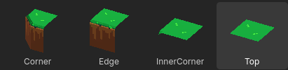

# GridMapLayer

This is a Godot addon for managing GridMaps through TileMapLayers!

## Examples

A couple of example scenes are provided:
- `example/example_scene.tsn`
	- Three GridMapLayers targeting one GridMap, creating a 3D island.
- `example/example_layer_baking.tscn`
	- A single GridMapLayerBaker, showing how a tileset is configured and gridmap tiles are placed over it.

## Getting Started

To get started you'll need a few things

1. A TileSet resource. GridMapLayer saves the information for tile placement in the custom data layers.
	- This only works with Atlas sources! And it assumes the atlas has no padding between tiles (currently!)

2. A MeshLibrary. GridMapLayerBaker will use the ids to save to the TileSet.
	- For a tileset with 1 subdivision (making it a 2x2 grid), you can get away with just four tiles! The same is true for any higher subdivision counts.

